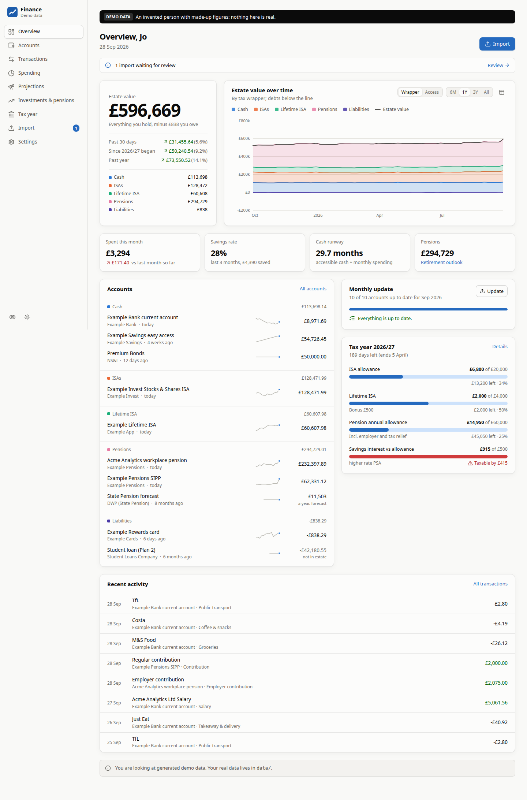

# Finance

A private, local-first personal finance tracker for the UK. It runs as a website on this machine
website you reach on that machine or your private network. You feed it bank statements, CSV/OFX/QIF
exports and screenshots of banking, ISA, LISA, SIPP and pension apps. It turns them into
structured, validated, git-versioned data in [`data/`](data/), and shows you the whole picture:

- **Estate value.** Everything you hold minus everything you owe, over time. It can be split by tax
  wrapper (cash, ISAs, LISA, investments, pensions, property, debts) or by when you could spend it.
- **Spending habits.** Where the money goes and how that is changing, regular payments and price
  rises, weekday and time-of-day patterns, top merchants, and plain-English insights.
- **Projections.** Where your estate value heads if the last 3 months, the last 12 months, or any
  past period you choose carried on, with a spending slider and category run-rates.
- **Investments & pensions.** Value against money paid in, money-weighted returns, holdings and
  allocation, LISA bonus and penalty-adjusted value, and a retirement outlook.
- **Tax year.** The ISA allowance (and the £12,000 cash-ISA cap from April 2027), the LISA, the
  pension annual allowance with carry-forward, and interest against your Personal Savings Allowance.
- **Self Assessment prep.** The figures an SA100 return usually needs, gathered from your data with
  their sources, gaps flagged, and a clear reminder that you must check everything yourself before
  you submit.

Everything you import is a draft until you've reviewed it against the original document side by
side. Nothing leaves the machine except PDFs and screenshots, which are read by Claude through your
own Claude login. That call is shown on every import, and CSV/OFX/QIF files are parsed locally.



## Quick start

```bash
npm install
npm run demo          # generated demo data at http://127.0.0.1:4750 — nothing real is touched
npm start             # your real data (./data) at http://127.0.0.1:4750
npm run dev           # development: API on :4750, UI with hot reload on http://127.0.0.1:4751
```

Requirements: Node 22.12+ (24 here). Optional: `tesseract-ocr` and `poppler-utils` for the offline
engine, and the [`claude`](https://claude.com/claude-code) CLI logged in (or `ANTHROPIC_API_KEY` in
`.env`) for reading PDFs and screenshots.

## The monthly routine (about ten minutes)

1. Open **Import**. The *Monthly update* list shows which accounts need data this month, and how to
   export it from each bank's app.
2. Drop everything in at once: CSV exports, PDF statements, screenshots of ISA, LISA and pension
   apps. On your phone, the same page opens your camera roll. Anything saved into `inbox/` (point a
   Syncthing folder at it) is picked up automatically.
3. Each file becomes a draft:
   - CSVs are parsed instantly.
   - PDFs and screenshots are read by Claude in 10–60 seconds.
   - Accounts are matched and transactions categorised.
   - Duplicates are flagged.
   - Statements are checked (opening balance + transactions = closing balance).
4. Click **Commit all ready** for the clean ones, and review the rest side by side with the
   original. Each commit becomes one git commit in `data/`.

## Commands

| Command | What it does |
|---|---|
| `npm start` | Build the UI and serve everything on `127.0.0.1:4750` |
| `npm run dev` | API with reload on :4750, Vite UI on :4751 |
| `npm run demo` / `npm run demo:reset` | Serve / regenerate the synthetic dataset in `demo-data/` |
| `npm run import -- <files…>` | Queue files for import from the terminal (copies them to `inbox/`) |
| `npm run set-password` | Set the login (scrypt hash into `.env`) |
| `npm run validate` | Check `data/` against the format (same checks as start-up) |
| `npm run schemas` | Regenerate the JSON Schemas in `schemas/` |
| `npm run check` | Typecheck + lint + tests |
| `npm run screens` | Screenshot every page in headless Chrome (fails on console errors) |

## Your data

`data/` is the product: plain JSON and JSONL, documented field by field in
[docs/DATA_FORMAT.md](docs/DATA_FORMAT.md), with JSON Schemas in [`schemas/`](schemas/). Money is in
pounds (2 dp), signed from your point of view. Dates are `YYYY-MM-DD`. Every record points back to
the import and original document it came from. You can query it with anything:

```bash
jq -s 'map(select(.category=="groceries")) | map(.amount) | add' data/transactions/*/2026.jsonl
duckdb -c "select category, sum(amount) from read_json('data/transactions/*/*.jsonl') group by 1 order by 2"
```

The app commits every change to `data/` automatically, so git history is a complete audit log.
Format changes are handled by versioned migrations, and derived fields (payees, categories,
transfer links) can be recomputed from stored source fields at any time. You never need to
re-import old documents. See [docs/ARCHITECTURE.md](docs/ARCHITECTURE.md).

## Security and privacy

- **Network exposure.** The server binds to `127.0.0.1` only. On P360, Caddy exposes it to the
  to a private network such as a tailnet. There is no public exposure; see
  [docs/DEPLOY.md](docs/DEPLOY.md).
- **Login.** Username and password: a scrypt hash in `.env`, a signed HttpOnly/Secure/SameSite=Strict
  cookie, and login throttling. Without a login configured, the app answers only direct local
  requests.
- **Request guards.** A Host allow-list blocks DNS rebinding, a CSRF header plus Origin check
  protects writes, a strict CSP applies, and there are no third-party origins.
- **What's stored.** Account numbers are kept as last 4 digits only. Original documents are
  archived in `data/documents/`, which can be switched off in Settings.
- **Keep the repository private.** It contains your financial history.

## Documentation

| | |
|---|---|
| [docs/ROADMAP.md](docs/ROADMAP.md) | Principles, what is not built yet, and what to revisit |
| [docs/ARCHITECTURE.md](docs/ARCHITECTURE.md) | How it works: store, ingestion pipeline, analytics, web app |
| [docs/DATA_FORMAT.md](docs/DATA_FORMAT.md) | The data format, file by file and field by field |
| [docs/INGESTION.md](docs/INGESTION.md) | Importers, adding a bank, how Claude extraction works |
| [docs/UK_RULES.md](docs/UK_RULES.md) | Tax-year rules and allowance tables, with sources |
| [docs/DEPLOY.md](docs/DEPLOY.md) | Running it as a service on P360 behind Caddy on the tailnet |
| [docs/DECISIONS.md](docs/DECISIONS.md) | Decision log |
